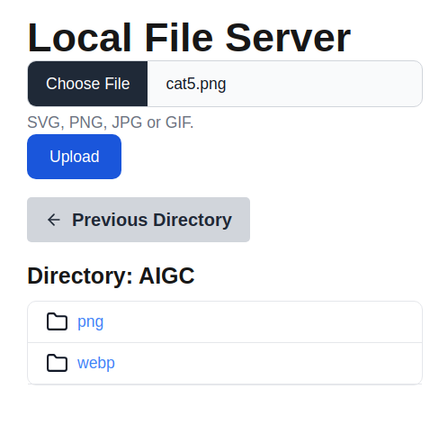

# LocalShare
cutting-edge, locally-hosted file server built using Next.js Flowbite UI
seamless and user-friendly experience for sharing and managing files across devices.

# What is it ?


# How to use ?

### 1. Download it and change the .env file to setup your Directory

```bash
BASE_DIR=${HOME}/Downloads
```
> ### 针对 Windows 和 macOS 的兼容性：
> - macOS 和 Linux 可以使用 ${HOME}/Downloads。
> - Windows 则应该使用类似 C:\Users\<Username>\Downloads 的路径。

### 2. Run
```bash
npm install
npm run dev
```
### 3. Open URL in your Browser
```
http://localhost:3000
http://127.0.0.1:3000
http://192.168.3.21:3000 IP in your LAN

```
### 4. Optimize Operation
```bash
npm run build
npm run start
```