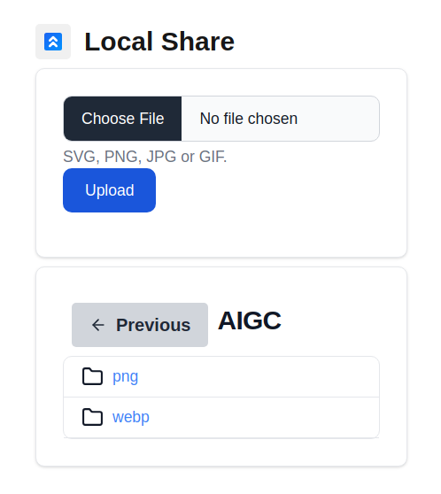

# LocalShare
LocalShare is a cutting-edge, locally-hosted file server built using Next.js, the popular React-based framework for server-side rendering. With a sleek and modern design crafted using Flowbite UI, a stylish and intuitive UI kit, LocalShare provides a seamless and user-friendly experience for sharing and managing files across devices.

### What is it ?


# How to use ?

### 1. Download it and change the .env file to setup your Directory

```bash
BASE_DIR=${HOME}/Downloads
```
### 2. Run
```bash
npm install
npm run dev
```
### 3. Open URL in your Browser
```
http://localhost:3000
http://127.0.0.1:3002
http://192.168.3.21:3002 IP in your LAN
```